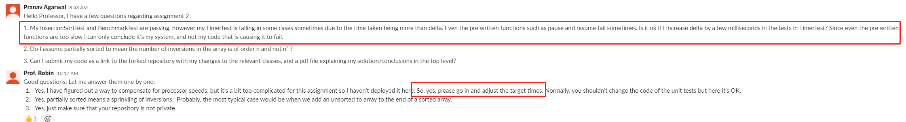
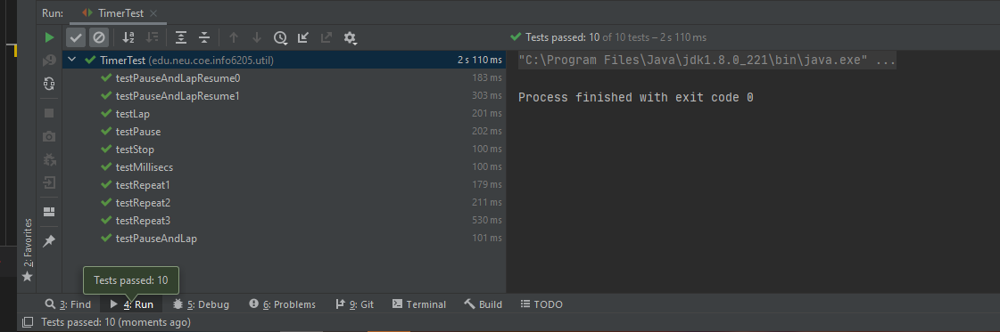
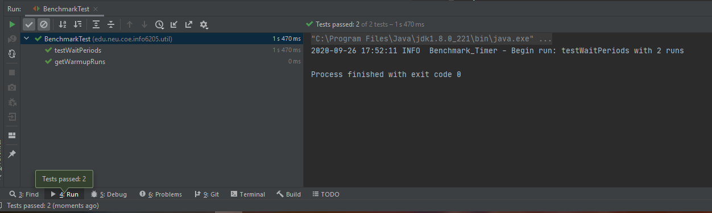
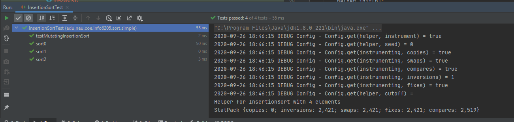
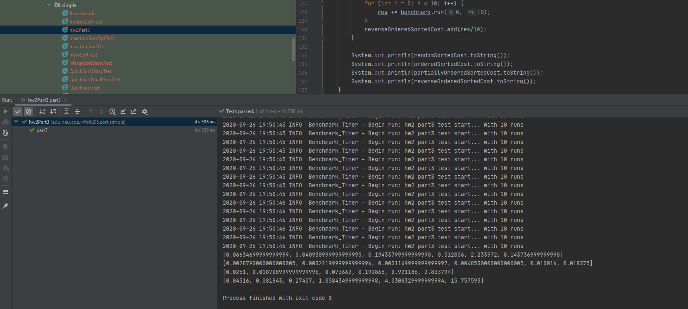
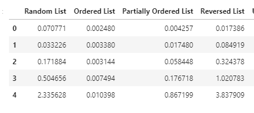
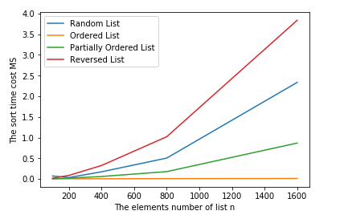

<div style="text-align:center">Zixiao Wang 001058840</div>
<div style="text-align:center; font-size:30px">INFO 6205</div>
<div style="text-align:center; font-size:20px">Program Structures & Algorithms</div>
<div style="text-align:center; font-size:20px">Fall 2020</div>
<div style="text-align:center; font-size:20px">Assignment No. 2</div>

The report format follows this [document](https://info6205fall2020group.slack.com/files/U01A4RKLF7H/F01AWSPRXPC/yourname_assignmetno.docx)

- [Task](#task)
  - [Part 1](#part-1)
  - [Part 2](#part-2)
  - [Part 3](#part-3)
- [Implementation - Code](#implementation---code)
  - [```Timer.java```](#timerjava)
  - [```InsertionSort.java```](#insertionsortjava)
  - [```hw2Part3.java```](#hw2part3java)
  - [```CSVExport.java```](#csvexportjava)
  - [Python Code](#python-code)
- [Screenshot of Unit Test Passing](#screenshot-of-unit-test-passing)
  - [Part Ⅰ](#part-ⅰ)
  - [Part Ⅱ](#part-ⅱ)
  - [Part Ⅲ](#part-ⅲ)

# Task

# Assignment 2 <!-- omit in toc -->


- [Part 1](#part-1)
- [Part 2](#part-2)
- [Part 3](#part-3)


Your task for this assignment is in three parts.

## Part 1

(Part 1) You are to implement four methods of a class called Timer. Please see the skeleton class that I created in the repository. Timer is invoked from a class called Benchmark_Timer which implements the Benchmark interface. The APIs of these class are as follows:

```java
public interface Benchmark<T> {
    default double run(T t, int m) {
        return runFromSupplier(() -> t, m);
    }

    double runFromSupplier(Supplier<T> supplier, int m);
}


public class Benchmark_Timer<T> implements Benchmark<T> {
public Benchmark_Timer(String description, UnaryOperator<T> fPre, Consumer<T> fRun, Consumer<T> fPost)
public Benchmark_Timer(String description, UnaryOperator<T> fPre, Consumer<T> fRun)
public Benchmark_Timer(String description, Consumer<T> fRun, Consumer<T> fPost)
public Benchmark_Timer(String description, Consumer<T> f)


public class Timer {
... // see below for methods to be implemented...
}


public <T, U> double repeat(int n, Supplier<T> supplier, Function<T, U> function, UnaryOperator<T> preFunction, Consumer<U> postFunction) {
// TO BE IMPLEMENTED
}


private static long getClock() {
    // TO BE IMPLEMENTED
}


private static double toMillisecs(long ticks) {
    // TO BE IMPLEMENTED
}
```

The function to be timed, hereinafter the "target" function, is the Consumer function fRun (or just f) passed in to one or other of the constructors. For example, you might create a function which sorts an array with n elements.

The generic type T is that of the input to the target function.

The first parameter to the first run method signature is the parameter that will, in turn, be passed to target function. In the second signature, supplier will be invoked each time to get a t which is passed to the other run method.

The second parameter to the run function (m) is the number of times the target function will be called.

The return value from run is the average number of milliseconds taken for each run of the target function.

Don't forget to check your implementation by running the unit tests in BenchmarkTest.

## Part 2

(Part 2) Implement InsertionSort (in the InsertionSort class) by simply looking up the insertion code used by Arrays.sort. You should use the helper.swap method although you could also just copy that from the same source code. In the main method of Benchmark, remove the reference to SelectionSort.

## Part 3

(Part 3) Measure the running times of this sort, using four different initial array ordering situations: random, ordered, partially-ordered and reverse-ordered. I suggest that your arrays to be sorted are of type Integer. Use the doubling method for choosing n and test for at least five values of n. Draw any conclusions from your observations regarding the order of growth.
As usual, the submission will be your entire project (clean, i.e. without the target and project folders). There are stubs and unit tests in the repository.

Report on your observations and show screenshots of the runs and also the unit tests. Please note that you may have to adjust the required execution time for the insertion sort unit test(s) because your computer may not run at the same speed as mine.

Further notes: you should use the System.nanoTime method to get the clock time. This isn't guaranteed to be accurate which is one of the reasons you should run the experiment several times for each value of n. Also, for each invocation of run, run the given target function ten times to get the system "warmed up" before you start the timing properly.

The Sort interface takes care of copying the array when the sort(array) signature is called. It returns a new array as a result. The original array is unchanged. Therefore, you do not need to worry about the insertion-based sorts getting quicker because of the arrays getting more sorted (they don't).

If you need clarification, ask on Slack.

# Implementation - Code

## [```Timer.java```](src/main/java/edu/neu/coe/info6205/util/Timer.java)

## [```InsertionSort.java```](src/main/java/edu/neu/coe/info6205/sort/simple/InsertionSort.java)

## [```hw2Part3.java```](src/test/java/edu/neu/coe/info6205/sort/simple/hw2Part3.java)

## [```CSVExport.java```](src/main/java/edu/neu/coe/info6205/util/CSVExport.java)

## [Python Code](./REPORT/)

**For this part of code, you should run it in jupyter notebook! Or you need to modify some part of it**

# Screenshot of Unit Test Passing

**Please note that I have make some adjustment of TEST CASE in order to adapt the target time**

According to the professor answer, it is allowed.



## Part Ⅰ


> Timer test result


> This is benchTest

## Part Ⅱ


> InsertionSortTest

## Part Ⅲ


> hw2Part3.java result

So here, I used ```hw2Part3.java``` for the part Ⅲ

First, measure the running times of this sort, using four different initial array ordering situations: random, ordered, partially-ordered and reverse-ordered.

The $n$ started from 100 and mutliply 2 for each time. This precess continue 5 times. Then I print the result following the random, ordered, partially-ordered and reverse-ordered one by one.


> Time cost recorded by program. For each row, the n times 2 (n start with 100, which indicate that the array has n elements)



1. We can easily find the the reverse order list spend the most time, which is $O(N^2)$
2. Random list has normal performance
3. Partially ordered list takes less time than random list.
4. Ordered list almost don't cost time for sorting.

