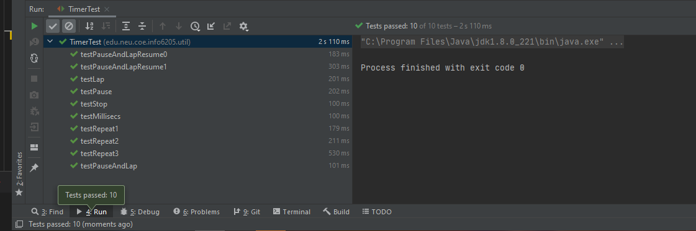

<div style="text-align:center">Zixiao Wang 001058840</div>
<div style="text-align:center; font-size:30px">INFO 6205</div>
<div style="text-align:center; font-size:20px">Program Structures & Algorithms</div>
<div style="text-align:center; font-size:20px">Fall 2020</div>
<div style="text-align:center; font-size:20px">Assignment No. 2</div>

The report format follows this [document](https://info6205fall2020group.slack.com/files/U01A4RKLF7H/F01AWSPRXPC/yourname_assignmetno.docx)

- [Task](#task)
  - [Part 1](#part-1)
  - [Part 2](#part-2)
  - [Part 3](#part-3)
- [Screenshot of Unit Test Passing](#screenshot-of-unit-test-passing)
  - [Part Ⅰ](#part-ⅰ)
  - [Part Ⅱ](#part-ⅱ)
  - [Part Ⅲ](#part-ⅲ)
- [Attach - Code](#attach---code)
  - [```Timer.java```](#timerjava)
  - [```InsertionSort.java```](#insertionsortjava)
  - [```hw2Part3.java```](#hw2part3java)
  - [```CSVExport.java```](#csvexportjava)
  - [Python Code](#python-code)

# Task

# Assignment 2 <!-- omit in toc -->


- [Part 1](#part-1)
- [Part 2](#part-2)
- [Part 3](#part-3)


Your task for this assignment is in three parts.

## Part 1

(Part 1) You are to implement four methods of a class called Timer. Please see the skeleton class that I created in the repository. Timer is invoked from a class called Benchmark_Timer which implements the Benchmark interface. The APIs of these class are as follows:

```java
public interface Benchmark<T> {
    default double run(T t, int m) {
        return runFromSupplier(() -> t, m);
    }

    double runFromSupplier(Supplier<T> supplier, int m);
}


public class Benchmark_Timer<T> implements Benchmark<T> {
public Benchmark_Timer(String description, UnaryOperator<T> fPre, Consumer<T> fRun, Consumer<T> fPost)
public Benchmark_Timer(String description, UnaryOperator<T> fPre, Consumer<T> fRun)
public Benchmark_Timer(String description, Consumer<T> fRun, Consumer<T> fPost)
public Benchmark_Timer(String description, Consumer<T> f)


public class Timer {
... // see below for methods to be implemented...
}


public <T, U> double repeat(int n, Supplier<T> supplier, Function<T, U> function, UnaryOperator<T> preFunction, Consumer<U> postFunction) {
// TO BE IMPLEMENTED
}


private static long getClock() {
    // TO BE IMPLEMENTED
}


private static double toMillisecs(long ticks) {
    // TO BE IMPLEMENTED
}
```

The function to be timed, hereinafter the "target" function, is the Consumer function fRun (or just f) passed in to one or other of the constructors. For example, you might create a function which sorts an array with n elements.

The generic type T is that of the input to the target function.

The first parameter to the first run method signature is the parameter that will, in turn, be passed to target function. In the second signature, supplier will be invoked each time to get a t which is passed to the other run method.

The second parameter to the run function (m) is the number of times the target function will be called.

The return value from run is the average number of milliseconds taken for each run of the target function.

Don't forget to check your implementation by running the unit tests in BenchmarkTest.

## Part 2

(Part 2) Implement InsertionSort (in the InsertionSort class) by simply looking up the insertion code used by Arrays.sort. You should use the helper.swap method although you could also just copy that from the same source code. In the main method of Benchmark, remove the reference to SelectionSort.

## Part 3

(Part 3) Measure the running times of this sort, using four different initial array ordering situations: random, ordered, partially-ordered and reverse-ordered. I suggest that your arrays to be sorted are of type Integer. Use the doubling method for choosing n and test for at least five values of n. Draw any conclusions from your observations regarding the order of growth.
As usual, the submission will be your entire project (clean, i.e. without the target and project folders). There are stubs and unit tests in the repository.

Report on your observations and show screenshots of the runs and also the unit tests. Please note that you may have to adjust the required execution time for the insertion sort unit test(s) because your computer may not run at the same speed as mine.

Further notes: you should use the System.nanoTime method to get the clock time. This isn't guaranteed to be accurate which is one of the reasons you should run the experiment several times for each value of n. Also, for each invocation of run, run the given target function ten times to get the system "warmed up" before you start the timing properly.

The Sort interface takes care of copying the array when the sort(array) signature is called. It returns a new array as a result. The original array is unchanged. Therefore, you do not need to worry about the insertion-based sorts getting quicker because of the arrays getting more sorted (they don't).

If you need clarification, ask on Slack.

# Screenshot of Unit Test Passing

## Part Ⅰ


> Timer test result


> This is benchTest

## Part Ⅱ


> InsertionSortTest

## Part Ⅲ


> hw2Part3.java result

So here, I used ```hw2Part3.java``` for the part Ⅲ

First, measure the running times of this sort, using four different initial array ordering situations: random, ordered, partially-ordered and reverse-ordered.

The $n$ started from 100 and mutliply 2 for each time. This precess continue 5 times. Then I print the result following the random, ordered, partially-ordered and reverse-ordered one by one.


> Time cost recorded by program. For each row, the n times 2 (n start with 100, which indicate that the array has n elements)


1. We can easily find the the reverse order list spend the most time, which is $O(N^2)$
2. Random list has normal performance
3. Partially ordered list takes less time than random list.
4. Ordered list almost don't cost time for sorting.

# Attach - Code

## ```Timer.java```

```java
package edu.neu.coe.info6205.util;

import java.util.function.Consumer;
import java.util.function.Function;
import java.util.function.Supplier;
import java.util.function.UnaryOperator;

public class Timer {

    /**
     * Construct a new Timer and set it running.
     */
    public Timer() {
        resume();
    }

    /**
     * Run the given function n times, once per "lap" and then return the result of calling stop().
     *
     * @param n        the number of repetitions.
     * @param function a function which yields a T (T may be Void).
     * @return the average milliseconds per repetition.
     */
    public <T> double repeat(int n, Supplier<T> function) {
        for (int i = 0; i < n; i++) {
            function.get();
            lap();
        }
        pause();
        return meanLapTime();
    }

    /**
     * Run the given functions n times, once per "lap" and then return the result of calling stop().
     *
     * @param n        the number of repetitions.
     * @param supplier a function which supplies a different T value for each repetition.
     * @param function a function T=>U and which is to be timed (U may be Void).
     * @return the average milliseconds per repetition.
     */
    public <T, U> double repeat(int n, Supplier<T> supplier, Function<T, U> function) {
        for (int i = 0; i < n; i++) {
            function.apply(supplier.get());
            lap();
        }
        pause();
        return meanLapTime();

    }

    /**
     * Pause (without counting a lap); run the given functions n times while being timed, i.e. once per "lap", and finally return the result of calling meanLapTime().
     *
     * @param n            the number of repetitions.
     * @param supplier     a function which supplies a T value.
     * @param function     a function T=>U and which is to be timed.
     * @param preFunction  a function which pre-processes a T value and which precedes the call of function, but which is not timed (may be null).
     * @param postFunction a function which consumes a U and which succeeds the call of function, but which is not timed (may be null).
     * @return the average milliseconds per repetition.
     */
    public <T, U> double repeat(int n, Supplier<T> supplier, Function<T, U> function, UnaryOperator<T> preFunction, Consumer<U> postFunction) {
        logger.trace("repeat: with " + n + " runs");
        // TO BE IMPLEMENTED: note that the timer is running when this method is called and should still be running when it returns.
        for (int i = 0; i < n; i++) {
            pause();
            if (preFunction != null) {
                preFunction.apply(supplier.get());
            }
            U res = null;
            resume();
            res = function.apply(supplier.get());
            pause();
            if (postFunction != null) {
                postFunction.accept(res);

            }
            resume();
            lap();
        }
        pause();

        return meanLapTime();
    }

    /**
     * Stop this Timer and return the mean lap time in milliseconds.
     *
     * @return the average milliseconds used by each lap.
     * @throws TimerException if this Timer is not running.
     */
    public double stop() {
        pauseAndLap();
        return meanLapTime();
    }

    /**
     * Return the mean lap time in milliseconds for this paused timer.
     *
     * @return the average milliseconds used by each lap.
     * @throws TimerException if this Timer is running.
     */
    public double meanLapTime() {
        if (running) throw new TimerException();
        return toMillisecs(ticks) / laps;
    }

    /**
     * Pause this timer at the end of a "lap" (repetition).
     * The lap counter will be incremented by one.
     *
     * @throws TimerException if this Timer is not running.
     */
    public void pauseAndLap() {
        lap();
        ticks += getClock();
        running = false;
    }

    /**
     * Resume this timer to begin a new "lap" (repetition).
     *
     * @throws TimerException if this Timer is already running.
     */
    public void resume() {
        if (running) throw new TimerException();
        ticks -= getClock();
        running = true;
    }

    /**
     * Increment the lap counter without pausing.
     * This is the equivalent of calling pause and resume.
     *
     * @throws TimerException if this Timer is not running.
     */
    public void lap() {
        if (!running) throw new TimerException();
        laps++;
    }

    /**
     * Pause this timer during a "lap" (repetition).
     * The lap counter will remain the same.
     *
     * @throws TimerException if this Timer is not running.
     */
    public void pause() {
        pauseAndLap();
        laps--;
    }

    /**
     * Method to yield the total number of milliseconds elapsed.
     * NOTE: an exception will be thrown if this is called while the timer is running.
     *
     * @return the total number of milliseconds elapsed for this timer.
     */
    public double millisecs() {
        if (running) throw new TimerException();
        return toMillisecs(ticks);
    }

    @Override
    public String toString() {
        return "Timer{" +
                "ticks=" + ticks +
                ", laps=" + laps +
                ", running=" + running +
                '}';
    }

    private long ticks = 0L;
    private int laps = 0;
    private boolean running = false;

    // NOTE: Used by unit tests
    private long getTicks() {
        return ticks;
    }

    // NOTE: Used by unit tests
    private int getLaps() {
        return laps;
    }

    // NOTE: Used by unit tests
    private boolean isRunning() {
        return running;
    }

    /**
     * Get the number of ticks from the system clock.
     * <p>
     * NOTE: (Maintain consistency) There are two system methods for getting the clock time.
     * Ensure that this method is consistent with toMillisecs.
     *
     * @return the number of ticks for the system clock. Currently defined as nano time.
     */
    private static long getClock() {
        // TO BE IMPLEMENTED
        return System.nanoTime();
    }

    /**
     * NOTE: (Maintain consistency) There are two system methods for getting the clock time.
     * Ensure that this method is consistent with getTicks.
     *
     * @param ticks the number of clock ticks -- currently in nanoseconds.
     * @return the corresponding number of milliseconds.
     */
    private static double toMillisecs(long ticks) {
        // TO BE IMPLEMENTED
        return ticks * Math.pow(10, -6);
    }

    final static LazyLogger logger = new LazyLogger(Timer.class);

    static class TimerException extends RuntimeException {
        public TimerException() {
        }

        public TimerException(String message) {
            super(message);
        }

        public TimerException(String message, Throwable cause) {
            super(message, cause);
        }

        public TimerException(Throwable cause) {
            super(cause);
        }
    }
}

```

## ```InsertionSort.java```

```java
/*
  (c) Copyright 2018, 2019 Phasmid Software
 */
package edu.neu.coe.info6205.sort.simple;

import edu.neu.coe.info6205.sort.BaseHelper;
import edu.neu.coe.info6205.sort.Helper;
import edu.neu.coe.info6205.sort.SortWithHelper;
import edu.neu.coe.info6205.util.Config;

public class InsertionSort<X extends Comparable<X>> extends SortWithHelper<X> {

    /**
     * Constructor for any sub-classes to use.
     *
     * @param description the description.
     * @param N           the number of elements expected.
     * @param config      the configuration.
     */
    protected InsertionSort(String description, int N, Config config) {
        super(description, N, config);
    }

    /**
     * Constructor for InsertionSort
     *
     * @param N      the number elements we expect to sort.
     * @param config the configuration.
     */
    public InsertionSort(int N, Config config) {
        this(DESCRIPTION, N, config);
    }

    public InsertionSort() {
        this(new BaseHelper<>(DESCRIPTION));
    }

    /**
     * Constructor for InsertionSort
     *
     * @param helper an explicit instance of Helper to be used.
     */
    public InsertionSort(Helper<X> helper) {
        super(helper);
    }

    /**
     * Sort the sub-array xs:from:to using insertion sort.
     *
     * @param xs   sort the array xs from "from" to "to".
     * @param from the index of the first element to sort
     * @param to   the index of the first element not to sort
     */
    public void sort(X[] xs, int from, int to) {
        final Helper<X> helper = getHelper();
        // TO BE IMPLEMENTED
        for(int i=from+1;i<to;i++){
            for(int j=i;j>0&&helper.less(xs[j],xs[j-1]);j--){
                helper.swap(xs,j-1,j);
            }
        }
    }

    /**
     * This is used by unit tests.
     *
     * @param ys  the array to be sorted.
     * @param <Y> the underlying element type.
     */
    public static <Y extends Comparable<Y>> void mutatingInsertionSort(Y[] ys) {
        new InsertionSort<Y>().mutatingSort(ys);
    }

    public static final String DESCRIPTION = "Insertion sort";

}

```

## ```hw2Part3.java```

```java
package edu.neu.coe.info6205.sort.simple;

import edu.neu.coe.info6205.sort.GenericSort;
import edu.neu.coe.info6205.util.Benchmark;
import edu.neu.coe.info6205.util.Benchmark_Timer;
import org.junit.Test;

import java.util.ArrayList;
import java.util.List;
import java.util.Random;

import static org.junit.Assert.assertEquals;

/**
 * @Author: Zixiao Wang
 * @Version: 1.0.0
 * @Description:
 **/

public class hw2Part3 {

    @Test
    public void part3() {

        final int N = 100;
        List<Double> randomSortedCost = new ArrayList<>();
        List<Double> orderedSortedCost = new ArrayList<>();
        List<Double> partiallyOrderedSortedCost = new ArrayList<>();
        List<Double> reverseOrderedSortedCost = new ArrayList<>();
        for (int n = 100; n <= N * Math.pow(2, 5); n = n * 2) {

            // Four array's situations: random, ordered, partially-ordered and reverse-ordered.
            // random
            List<Integer> randomList = new ArrayList<>();
            Random random = new Random();
            for (int i = 0; i < n; i++) {
                randomList.add(random.nextInt(n));
            }
//            System.out.println("Random list");
//            System.out.println(randomList.toString());

            // ordered
            List<Integer> orderedList = new ArrayList<>();
            for (int i = 0; i < n; i++) {
                orderedList.add(i);
            }
//            System.out.println("Ordered list");
//            System.out.println(orderedList.toString());

            // partially-ordered
            List<Integer> partiallyOrderedList = new ArrayList<>();
            for (int i = 0; i < n; i++) {
                if (random.nextInt(100) < 70) {
                    partiallyOrderedList.add(i);
                } else {
                    partiallyOrderedList.add((random.nextInt(n)));
                }
            }
//            System.out.println("Partially-ordered list");
//            System.out.println(partiallyOrderedList.toString());

            // reverse-ordered
            List<Integer> reverseOrderedList = new ArrayList<>();
            for (int i = 0; i < n; i++) {
                reverseOrderedList.add(n - i);
            }
//            System.out.println("Reverse ordered list");
//            System.out.println(reverseOrderedList);


            // ************************************************************************
            // sort random list
            GenericSort insertionSort = new InsertionSort();

            Benchmark<Integer> benchmark = new Benchmark_Timer<>("hw2 part3 test start...",
                    blank -> {
                        insertionSort.sort(randomList);
                    });
            // warm up
            benchmark.run(0, 10)
            // get average run time
            double res = 0;
            for (int i = 0; i < 10; i++) {
                res += benchmark.run(0, 10);
            }
            randomSortedCost.add(res/10);

            // ************************************************************************
            // sort ordered list
            benchmark = new Benchmark_Timer<>("hw2 part3 test start...",
                    blank -> {
                        insertionSort.sort(orderedList);
                    });
            // warm up
            benchmark.run(0, 10)
            // get average run time
            res = 0;
            for (int i = 0; i < 10; i++) {
                res += benchmark.run(0, 10);
            }
            orderedSortedCost.add(res/10);

            // ************************************************************************
            // sort partically-ordered list
            benchmark = new Benchmark_Timer<>("hw2 part3 test start...",
                    blank -> {
                        insertionSort.sort(partiallyOrderedList);
                    });
            // warm up
            benchmark.run(0, 10)
            // get average run time
            res = 0;
            for (int i = 0; i < 10; i++) {
                res += benchmark.run(0, 10);
            }
            partiallyOrderedSortedCost.add(res/10);

            // ************************************************************************
            // sort reverse order list
            benchmark = new Benchmark_Timer<>("hw2 part3 test start...",
                    blank -> {
                        insertionSort.sort(reverseOrderedList);
                    });
            // warm up
            benchmark.run(0, 10)
            // get average run time
            res = 0;
            for (int i = 0; i < 10; i++) {
                res += benchmark.run(0, 10);
            }
            reverseOrderedSortedCost.add(res/10);
        }

        System.out.println(randomSortedCost.toString());
        System.out.println(orderedSortedCost.toString());
        System.out.println(partiallyOrderedSortedCost.toString());
        System.out.println(reverseOrderedSortedCost.toString());
    }
}


```

## ```CSVExport.java```

```java
package edu.neu.coe.info6205.util;

import java.io.*;
import java.util.List;

/**
 * @Author: Zixiao Wang
 * @Version: 1.0.0
 * @Description: Export CSV file
 **/

public class CSVExport {


    /**
     * @author: Zixiao Wang
     * @date: 9/20/2020
     * @param: head
     * @param: dataList
     * @param: outputPath
     * @param: filename
     * @return: java.io.File
     * @description: Create the file object for writing the data
     **/
    public static File createCSVFile(List<Object> head, List<List<Object>> dataList, String outputPath, String filename) {
        File csvFile = null;
        BufferedWriter csvWtriter = null;
        try {
            csvFile = new File(outputPath + File.separator + filename + ".csv");

            // if parent filepath exist or not
            File parent = csvFile.getParentFile();
            if (parent != null && !parent.exists()) {
                parent.mkdirs();
            }
            csvFile.createNewFile();

            // GB2312 use split character ","
            csvWtriter = new BufferedWriter(new OutputStreamWriter(new FileOutputStream(
                    csvFile), "GB2312"), 1024);
            // write head
            writeRow(head, csvWtriter);

            // write data
            for (List<Object> row : dataList) {
                writeRow(row, csvWtriter);
            }
            csvWtriter.flush();
        } catch (Exception e) {
            e.printStackTrace();
        } finally {
            try {
                csvWtriter.close();
            } catch (IOException e) {
                e.printStackTrace();
            }
        }
        return csvFile;
    }

    /**
     * @author: Zixiao Wang
     * @date: 9/20/2020
     * @param: row
     * @param: csvWriter
     * @return: void
     * @description: Write all data into file
     **/
    private static void writeRow(List<Object> row, BufferedWriter csvWriter) throws IOException {
        // write head
        for (Object data : row) {
            StringBuffer sb = new StringBuffer();
            String rowStr = sb.append("\"").append(data).append("\",").toString();
            csvWriter.write(rowStr);
        }
        csvWriter.newLine();
    }

}
```

## Python Code

**For this part of code, you should run it in jupyter notebook! Or you need to modify some part of it**

```python
from matplotlib import pyplot as plt
import numpy as np
import pandas as pd
%matplotlib inline


cost = pd.read_csv("./hw2.csv")

x = np.logspace(0,4,5,base=2)*100

plt.plot(x,cost["Random List"],label="Random List")
plt.plot(x,cost["Ordered List"],label="Ordered List")
plt.plot(x,cost["Partially Ordered List"],label="Partially Ordered List")
plt.plot(x,cost["Reversed List"],label="Reversed List")
plt.xlabel("The elements number of list n")
plt.ylabel("The sort time cost MS")

plt.legend()
```