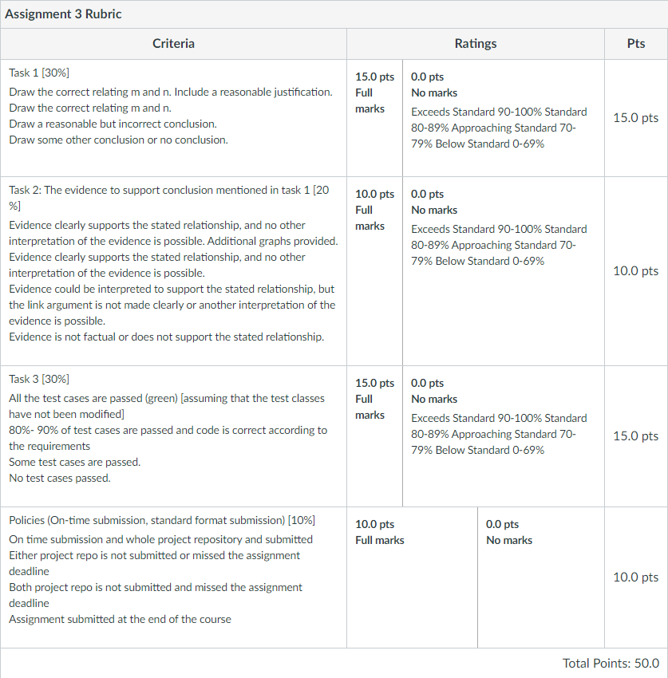
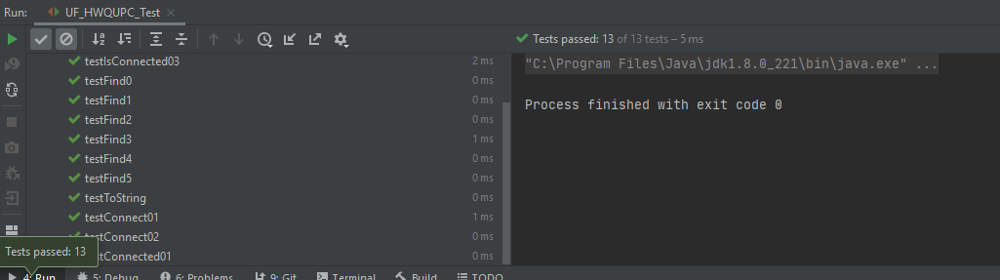
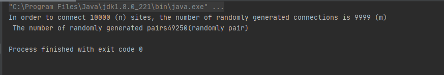
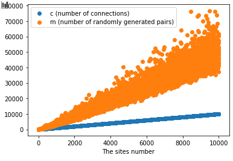
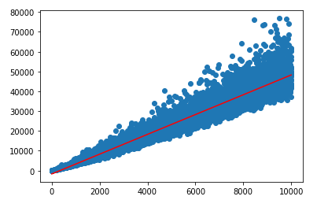
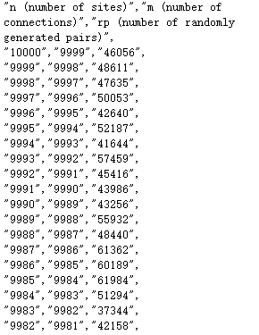

<div style="text-align:center">Zixiao Wang 001058840</div>
<div style="text-align:center; font-size:30px">INFO 6205</div>
<div style="text-align:center; font-size:20px">Program Structures & Algorithms</div>
<div style="text-align:center; font-size:20px">Fall 2020</div>
<div style="text-align:center; font-size:20px">Assignment No. 3</div>

The report format follows this [document](https://info6205fall2020group.slack.com/files/U01A4RKLF7H/F01AWSPRXPC/yourname_assignmetno.docx)

- [Task](#task)
  - [Step 1](#step-1)
  - [Step 2](#step-2)
  - [Step 3](#step-3)
- [Output](#output)
  - [Step 1](#step-1-1)
    - [```UF_HWQUPC_Test``` Unit test](#uf_hwqupc_test-unit-test)
  - [Step 2](#step-2-1)
    - [```UF_HWQUPC_Client.java``` Output](#uf_hwqupc_clientjava-output)
  - [Step 3](#step-3-1)
    - [Model output](#model-output)
    - [Relationship](#relationship)
  - [```CSVExport.java``` Output](#csvexportjava-output)
- [Tasks](#tasks)
  - [Task 1](#task-1)
  - [Task 2](#task-2)
  - [Task 3](#task-3)
- [Implementation - Code](#implementation---code)
  - [```UF_HWQUPC.java```](#uf_hwqupcjava)
  - [```UF_HWQUPC_Client.java```](#uf_hwqupc_clientjava)
  - [```CSVExport.java```](#csvexportjava)
  - [Python Code](#python-code)

# Task

Your task is

## Step 1

(a) Implement height-weighted Quick Union with Path Compression. For this, you will flesh out the class UF_HWQUPC. All you have to do is to fill in the sections marked with // TO BE IMPLEMENTED ... // ...END IMPLEMENTATION.

(b) Check that the unit tests for this class all work. You must show "green" test results in your submission (screenshot is OK). 

## Step 2

Using your implementation of UF_HWQUPC, develop a UF ("union-find") client that takes an integer value n from the command line to determine the number of "sites." Then generates random pairs of integers between 0 and n-1, calling connected() to determine if they are connected and union() if not. Loop until all sites are connected then print the number of connections generated. Package your program as a static method count() that takes n as the argument and returns the number of connections; and a main() that takes n from the command line, calls count() and prints the returned value. If you prefer, you can create a main program that doesn't require any input and runs the experiment for a fixed set of n values. Show evidence of your run(s).

## Step 3

Determine the relationship between the number of objects (n) and the number of pairs (m) generated to accomplish this (i.e. to reduce the number of components from n to 1). Justify your conclusion.

Don't forget to follow the submission guidelines. And to use sufficient (and sufficiently large) different values of n.



# Output

## Step 1

### ```UF_HWQUPC_Test``` Unit test



> All test case passed

## Step 2

### ```UF_HWQUPC_Client.java``` Output



> In order to connect 10000 (n) sites, the number of randomly generated connections is 9999 (m) The number of randomly generated pairs 43385 (randomly pair)

## Step 3

### Model output





> Red line is the linear regression to model the (n,m)

### Relationship

The relationship between the number of objects (n) and the number of pairs (m) generated(i.e. to reduce the number of components from n to 1) is:

$m = 4.995\times n - 1724.3$

## ```CSVExport.java``` Output



> Data output for model the relation about N and randomly generated pairs

# Tasks

## Task 1

The relationship between m and n is

$m = 4.995\times n - 1724.3$

## Task 2

I implement the ```UF_HWQUPC_Client.java``` and then save the m by to reduce the number of components from n to 1.


> You can see the raw relationship between m(orange) and n

Then use the linear regression to model the data. Then I got the result.


> Red line is the linear regression to model the (n,m)

And the coefficient is as this function:

$m = 4.995\times n - 1724.3$

## Task 3


> All test cases passed

# Implementation - Code

## [```UF_HWQUPC.java```](src/main/java/edu/neu/coe/info6205/union_find/UF_HWQUPC.java)

## [```UF_HWQUPC_Client.java```](src/main/java/edu/neu/coe/info6205/union_find/UF_HWQUPC_Client.java)

## [```CSVExport.java```](src/main/java/edu/neu/coe/info6205/util/CSVExport.java)

## [Python Code](assignment_3\hw3.ipynb)

**For this part of code, you should run it in jupyter notebook! Or you need to modify some part of it**