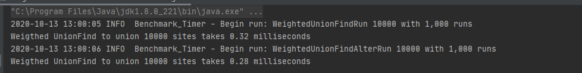
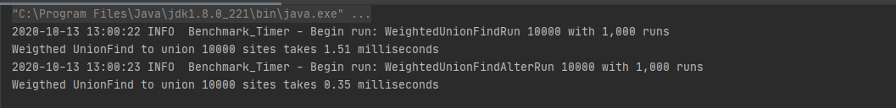

Zixiao Wang 001058840

INFO 6205

Program Structures & Algorithms

Fall 2020

Assignment 3 - alternatives

The report format follows this [document](https://info6205fall2020group.slack.com/files/U01A4RKLF7H/F01AWSPRXPC/yourname_assignmetno.docx)

- [Task](#task)
- [Output](#output)
- [Implementation - Code](#implementation---code)
  - [WeightedUnionFind.java](#weightedunionfindjava)
  - [WeightedUnionFindAlter.java](#weightedunionfindalterjava)
  - [WeigthedUnionFindAlterAndNonAlterBenchmarking.java](#weigthedunionfindalterandnonalterbenchmarkingjava)
  - [UF_HWQUPC.java](#uf_hwqupcjava)
  - [UF_HWQUPC_ALTER.java](#uf_hwqupc_alterjava)
  - [WeigthedUnionFindAlterAndNonAlterBenchmarking.java](#weigthedunionfindalterandnonalterbenchmarkingjava-1)

# Task

We mentioned two alternatives for implementing Union-Find:

1. For weighted quick union, store the depth rather than the size;
2. For weighted quick union with path compression, do two loops, so that all intermediate nodes point to the root, not just the alternates.

For both of these, code the alternative and benchmark it against the implementation in the repository. You have all of that available from a previous assignment.

If you can explain why alternative #1 is unnecessary to be benchmarked, you may skip benchmarking that one.

Usual submission rules apply. 40 points only for this one.

# Output

For weighted quick union, store the depth rather than the size;

Compare the running time for unioning 10000 sites

> The time cost of storing size and storing depth are pretty same.

For weighted quick union with path compression, do two loops, so that all intermediate nodes point to the root, not just the alternates.

Compare the running time for unioning 10000 sites

> The alter version is faster than previous one.

# Implementation - Code

## [WeightedUnionFind.java](src/main/java/edu/neu/coe/info6205/union_find/WeightedUnionFind.java)

## [WeightedUnionFindAlter.java](src/main/java/edu/neu/coe/info6205/union_find/WeightedUnionFindAlter.java)

## [WeigthedUnionFindAlterAndNonAlterBenchmarking.java](src/main/java/edu/neu/coe/info6205/union_find/WeigthedUnionFindAlterAndNonAlterBenchmarking.java)

## [UF_HWQUPC.java](src/main/java/edu/neu/coe/info6205/union_find/UF_HWQUPC.java)

## [UF_HWQUPC_ALTER.java](src/main/java/edu/neu/coe/info6205/union_find/UF_HWQUPC_ALTER.java)

## [WeigthedUnionFindAlterAndNonAlterBenchmarking.java](src/main/java/edu/neu/coe/info6205/union_find/WeigthedUnionFindPCAlterAndNonAlterBenchmarking.java)